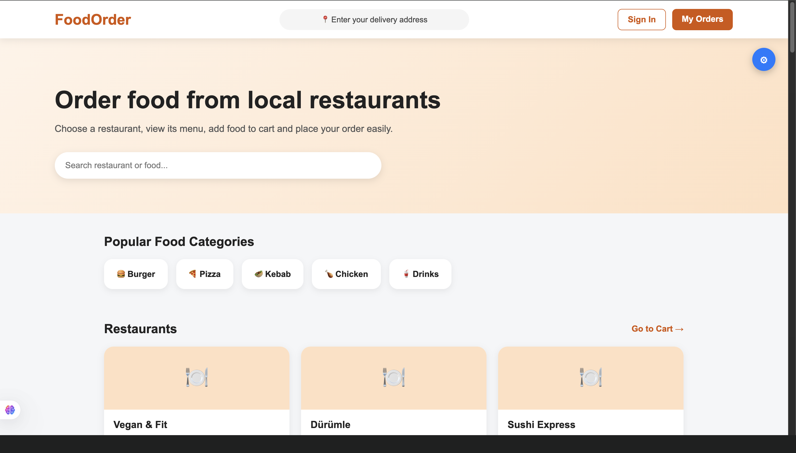
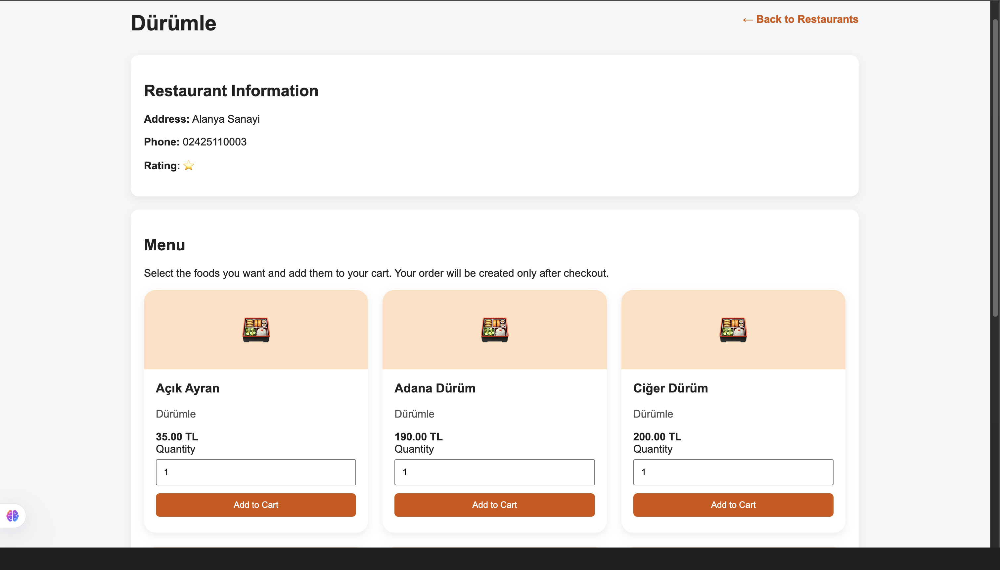
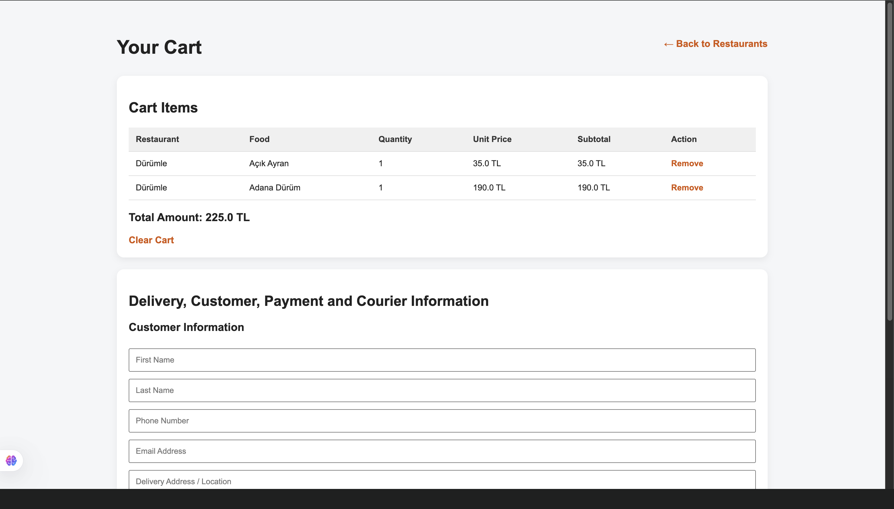
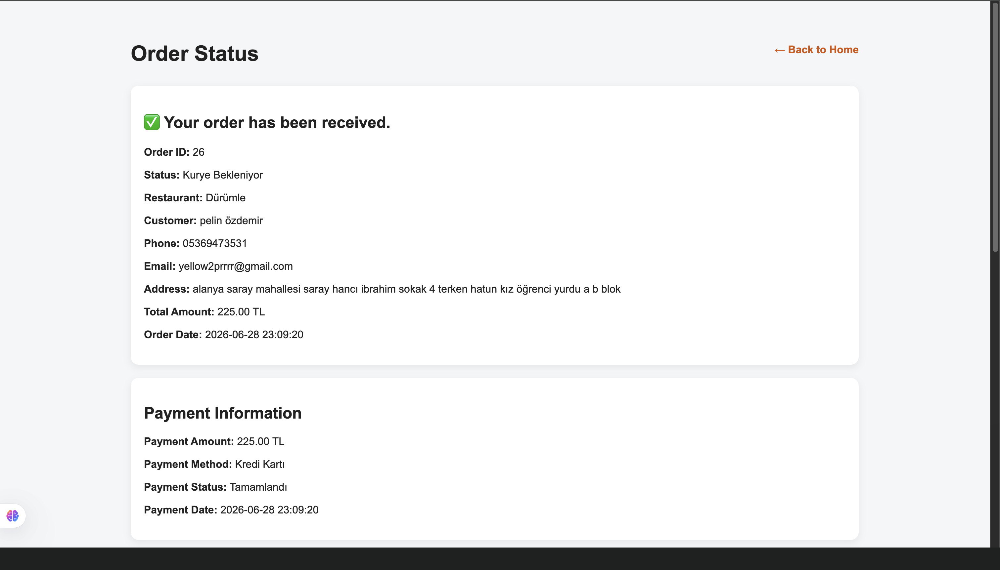
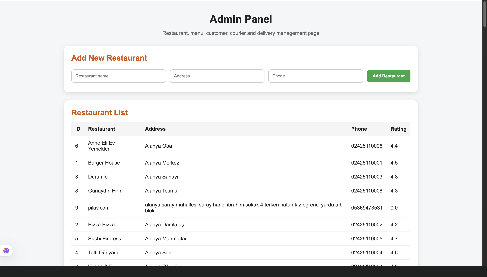
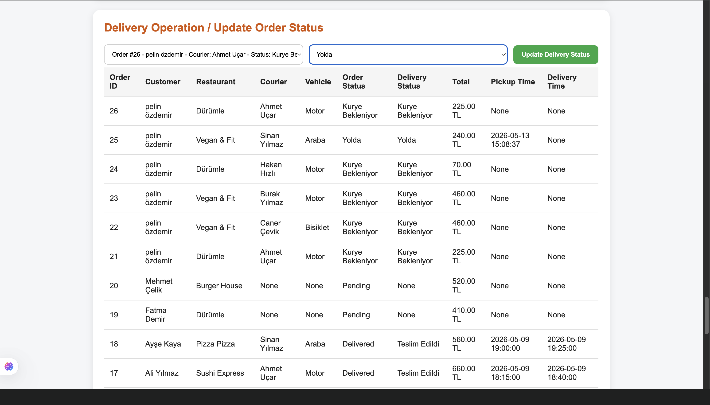

# Food Order Web App

A local food ordering and courier management web application built with Flask, MySQL, HTML and CSS.

## Project Overview

This project is a simple food ordering system where users can view restaurants, browse menus, place orders and manage order information. It also includes database tables for customers, restaurants, menu items, orders and order details.

The project was developed as a database/web application course project.

## Technologies Used

- Python
- Flask
- MySQL
- HTML
- CSS
- Git & GitHub

## Main Features

- Restaurant listing
- Menu display
- Customer order creation
- MySQL database connection
- Order and order item management
- Basic web interface with HTML/CSS templates

## Screenshots

### Home Page
The home page allows users to browse local restaurants and search for food or restaurant names.



### Restaurant Menu
Users can select a restaurant, view menu items, choose quantities and add food to the cart.



### Cart Page
Users can review cart items, see the total amount and continue to checkout.



### Order Success Page
After checkout, the system creates an order and displays order, payment and customer information.



### Admin Panel
The admin panel allows restaurant, menu, customer, courier and delivery management.



### Delivery Management
Order and courier statuses can be updated through the delivery operation page.


## Project Structure

```text
food-order-web-app/
│
├── app.py
├── db.py
├── food_order_database.sql
├── routes/
├── static/
├── templates/
└── README.md
